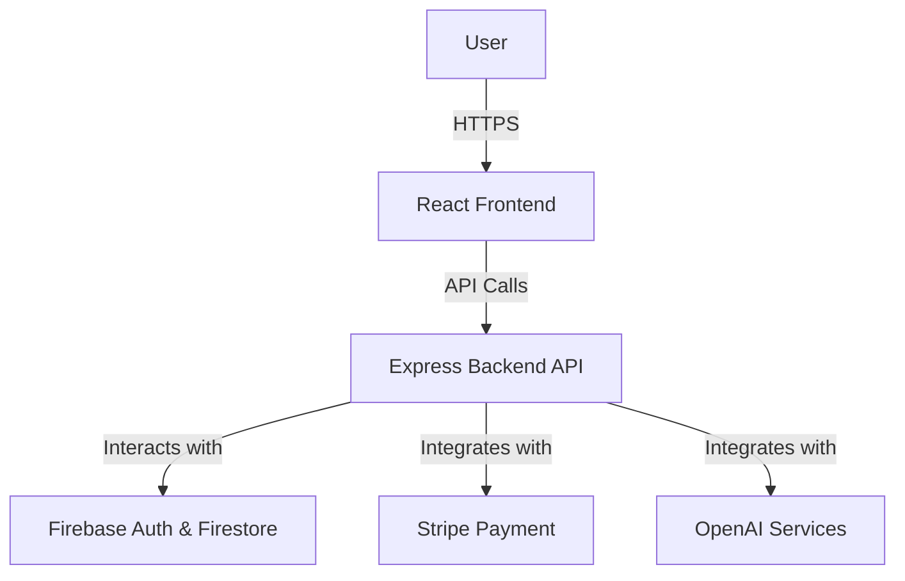
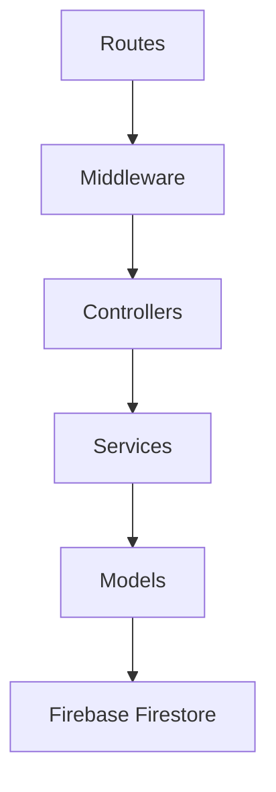
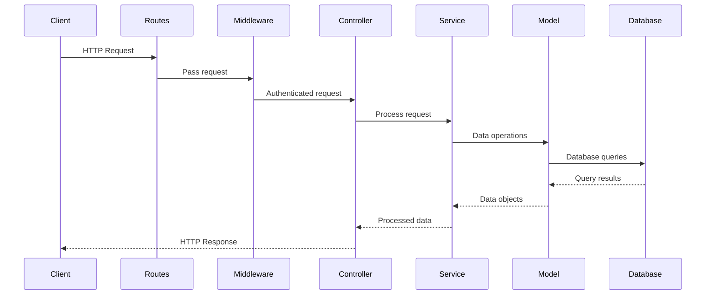
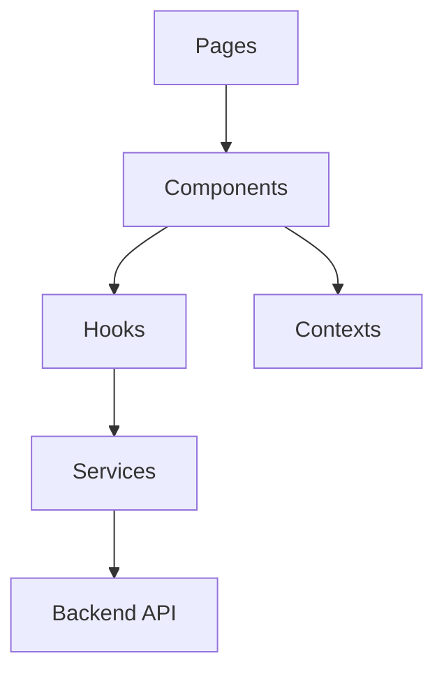

# System Architecture & Design Patterns

**This document is the canonical source for the project's system architecture, design patterns, and technical guidelines. All development work must align with the principles and structures outlined herein. Deviations require explicit approval and documentation.**

## 1. Overall Architecture Philosophy

The Psychic application follows a **Layered Architecture** with a **Modular Monolith** approach. This architecture provides clear separation between the presentation layer (React frontend), application layer (Express API), and data layer (Firebase Firestore).

- **Layered Architecture**: Ensures separation of concerns, making the codebase more maintainable and easier to understand.
- **Modular Monolith**: While deployed as a single unit, the application is internally organized into cohesive modules with clear boundaries. This approach balances simplicity and maintainability, allowing for future decomposition into microservices if needed.

Key architectural principles:
- Separation of concerns
- Modularity
- Maintainability
- Scalability
- Security



## 2. Backend System Patterns

### 2.1. Core Backend Architecture

The backend follows a layered architecture with the following components:

- **Routes Layer**: Defines API endpoints and routes requests to appropriate controllers
- **Middleware Layer**: Handles cross-cutting concerns like authentication, validation, and error handling
- **Controller Layer**: Processes requests and coordinates with services
- **Service Layer**: Implements business logic and interacts with data models
- **Model Layer**: Defines data structures and interacts with the database



### 2.2. Key Backend Design Patterns

1. **Repository Pattern**
   - **Description**: Abstracts the data layer and provides a collection-like interface for accessing domain objects.
   - **Application**: Service modules act as repositories, abstracting the details of API calls and database interactions.
   - **Benefits**: Improves testability, provides a consistent interface for data access, and makes it easier to change the underlying data source if needed.

2. **Middleware Pattern**
   - **Description**: Components process requests and responses in a pipeline.
   - **Application**: Express middleware functions handle cross-cutting concerns like authentication, validation, and error handling.
   - **Benefits**: Promotes separation of concerns, enables reusable components for common tasks, and simplifies request handling logic.

3. **Service Layer Pattern**
   - **Description**: Encapsulates business logic in dedicated service modules.
   - **Application**: Business logic is separated from controllers and models, making it more testable and maintainable.
   - **Benefits**: Improves code organization, enhances testability, and promotes reuse of business logic.

### 2.3. Backend Component Relationships & Flows

The backend follows a request-response flow:



Key flows include:
- Authentication flow (login, registration, password reset)
- User profile management flow
- Reading history storage and retrieval
- Subscription management flow
- Psychic reading service flow

### 2.4. Backend Module/Directory Structure

```
server/                                # Backend application
├── config/                            # Configuration files
│   ├── firebase.config.js             # Firebase configuration
│   ├── stripe.config.js               # Stripe configuration
│   └── openai.config.js               # OpenAI configuration
├── controllers/                       # API route controllers
│   ├── auth.controller.js             # Authentication endpoints
│   ├── user.controller.js             # User profile endpoints
│   ├── reading.controller.js          # Reading history endpoints
│   ├── subscription.controller.js     # Subscription endpoints
│   ├── admin.controller.js            # Admin endpoints
│   └── psychic.controller.js          # Psychic reading endpoints
├── middleware/                        # Express middleware
│   ├── auth.middleware.js             # Authentication middleware
│   ├── validation.middleware.js       # Request validation
│   ├── error.middleware.js            # Error handling
│   └── admin.middleware.js            # Admin access control
├── models/                            # Data models
│   ├── user.model.js                  # User profile model
│   ├── reading.model.js               # Reading history model
│   └── subscription.model.js          # Subscription model
├── routes/                            # API route definitions
│   ├── auth.routes.js                 # Authentication routes
│   ├── user.routes.js                 # User profile routes
│   ├── reading.routes.js              # Reading history routes
│   ├── subscription.routes.js         # Subscription routes
│   ├── admin.routes.js                # Admin routes
│   └── psychic.routes.js              # Psychic reading routes
├── services/                          # Business logic services
│   ├── auth.service.js                # Authentication logic
│   ├── user.service.js                # User profile logic
│   ├── reading.service.js             # Reading history logic
│   ├── subscription.service.js        # Subscription logic
│   ├── admin.service.js               # Admin functions
│   ├── openai.service.js              # OpenAI integration
│   └── stripe.service.js              # Stripe integration
├── utils/                             # Utility functions
│   ├── validation.js                  # Input validation
│   ├── security.js                    # Security helpers
│   └── formatters.js                  # Response formatters
├── server.js                          # Express server entry point
└── package.json
```

## 3. Frontend System Patterns

### 3.1. Core Frontend Architecture

The frontend follows a component-based architecture using React. It's organized around:

- **Pages**: Top-level components that represent different routes in the application
- **Components**: Reusable UI elements organized by feature and responsibility
- **Contexts**: Global state management using React Context API
- **Hooks**: Reusable logic encapsulated in custom hooks
- **Services**: API communication layer



### 3.2. Key Frontend Technical Decisions & Patterns

1. **Context Provider Pattern**
   - **Description**: Uses React's Context API to provide state and functionality to components without prop drilling.
   - **Application**: AuthContext and UserContext provide authentication state and user profile data to components throughout the application.
   - **Benefits**: Reduces component coupling, simplifies access to global state, and makes the codebase more maintainable.

2. **Custom Hooks Pattern**
   - **Description**: Encapsulates reusable logic in custom hooks.
   - **Application**: Hooks like useAuth, useFirebase, and useSubscription provide reusable functionality to components.
   - **Benefits**: Promotes code reuse, simplifies component logic, and improves testability.

3. **Service Layer Pattern**
   - **Description**: Abstracts API communication in dedicated service modules.
   - **Application**: Service modules handle API calls and data transformation.
   - **Benefits**: Centralizes API communication, simplifies error handling, and improves maintainability.

4. **Protected Routes Pattern**
   - **Description**: Restricts access to certain routes based on authentication state.
   - **Application**: ProtectedRoute component ensures that authenticated routes are only accessible to logged-in users.
   - **Benefits**: Implements session control requirements, improves security, and enhances user experience.

### 3.3. Frontend Component Relationships & Structure

```
client/                                # Frontend application
├── public/
│   └── index.html
├── src/
│   ├── App.jsx                        # Main application component
│   ├── components/
│   │   ├── auth/                      # Authentication components
│   │   │   ├── Login.jsx
│   │   │   ├── Register.jsx
│   │   │   ├── PasswordReset.jsx
│   │   │   └── SocialLogin.jsx
│   │   ├── common/                    # Shared UI components
│   │   │   ├── Button.jsx
│   │   │   ├── Modal.jsx
│   │   │   ├── Notification.jsx
│   │   │   └── ProtectedRoute.jsx     # Route guard for authenticated routes
│   │   ├── layout/                    # Layout components
│   │   │   ├── Footer.jsx
│   │   │   ├── Navigation.jsx
│   │   │   └── UserMenu.jsx           # User dropdown in navigation
│   │   ├── profile/                   # User profile components
│   │   │   ├── ProfileView.jsx
│   │   │   ├── ProfileEdit.jsx
│   │   │   └── ReadingHistory.jsx
│   │   ├── subscription/              # Subscription components
│   │   │   ├── PlanSelection.jsx
│   │   │   ├── PaymentForm.jsx
│   │   │   └── SubscriptionManagement.jsx
│   │   ├── admin/                     # Admin components
│   │   │   ├── Dashboard.jsx
│   │   │   ├── UserManagement.jsx
│   │   │   └── ContentModeration.jsx
│   │   ├── Astrology/                 # Existing feature components
│   │   ├── CrystalReader/
│   │   ├── PalmReader/
│   │   └── TarotReader/
│   ├── contexts/                      # React contexts
│   │   ├── AuthContext.jsx            # Authentication state
│   │   └── UserContext.jsx            # User profile state
│   ├── hooks/                         # Custom React hooks
│   │   ├── useAuth.js                 # Authentication hook
│   │   ├── useFirebase.js             # Firebase interaction hook
│   │   └── useSubscription.js         # Subscription management hook
│   ├── pages/                         # Page components
│   │   ├── Home.jsx
│   │   ├── Login.jsx
│   │   ├── Register.jsx
│   │   ├── Profile.jsx
│   │   ├── Subscription.jsx
│   │   ├── Admin.jsx
│   │   ├── TarotReading.jsx
│   │   ├── PalmReading.jsx
│   │   └── NotFound.jsx
│   ├── services/                      # API service modules
│   │   ├── api.js                     # API client setup
│   │   ├── auth.service.js            # Authentication API calls
│   │   ├── user.service.js            # User profile API calls
│   │   ├── reading.service.js         # Reading history API calls
│   │   ├── subscription.service.js    # Subscription API calls
│   │   └── psychic.service.js         # Psychic reading API calls
│   ├── utils/                         # Utility functions
│   │   ├── firebase.js                # Firebase configuration
│   │   ├── validation.js              # Form validation helpers
│   │   └── formatters.js              # Data formatting helpers
│   ├── styles/                        # CSS/SCSS styles
│   │   ├── app.scss
│   │   ├── components/
│   │   ├── pages/
│   │   └── tailwind.scss
│   └── index.js                       # Application entry point
├── package.json
├── webpack.config.js
├── babel.config.js
└── tailwind.config.js
```

### 3.4. Critical Frontend Implementation Paths/Flows

1. **Authentication Flow**
   - User navigates to login/register page
   - User submits credentials
   - AuthContext updates authentication state
   - User is redirected to protected content

2. **Profile Management Flow**
   - Authenticated user navigates to profile page
   - User views/edits profile information
   - Changes are saved to backend via user.service.js
   - Profile data is updated in UserContext

3. **Subscription Management Flow**
   - User navigates to subscription page
   - User selects a subscription plan
   - User enters payment information
   - Payment is processed via Stripe
   - Subscription status is updated in backend and frontend

4. **Psychic Reading Flow**
   - User navigates to a reading service (Tarot, Palm, etc.)
   - User interacts with the reading interface
   - Reading request is sent to backend
   - Response is processed and displayed to user
   - Reading is saved to user's history

## 4. Cross-Cutting Concerns & Platform-Wide Patterns

### Error Handling

- **Frontend**: Centralized error handling in service layer with appropriate UI feedback
- **Backend**: Middleware-based error handling with consistent error response format
- **Logging**: Error logging with contextual information for debugging

### Logging

- **Frontend**: Console logging in development, error reporting service in production
- **Backend**: Structured logging with severity levels, timestamps, and request context
- **Monitoring**: Integration with monitoring tools for production environment

### Validation

- **Frontend**: Form validation using custom validation helpers
- **Backend**: Request validation using middleware
- **Shared**: Common validation rules for consistent user experience

### Security

- **Authentication**: Firebase Authentication for secure user authentication
- **Authorization**: Role-based access control for protected resources
- **Data Protection**: Secure storage of sensitive data
- **API Security**: JWT-based authentication for API requests
- **Input Validation**: Thorough validation of all user inputs

### Configuration Management

- **Environment Variables**: Use of .env files for environment-specific configuration
- **Feature Flags**: Configuration-based feature toggling
- **Service Configuration**: Centralized configuration for external services

### API Design Principles

- **RESTful Design**: Consistent RESTful API design
- **Resource-Based Routes**: Clear, resource-based route naming
- **Status Codes**: Appropriate use of HTTP status codes
- **Response Format**: Consistent JSON response format
- **Error Handling**: Detailed error messages with appropriate status codes

### Testing Strategy

- **Unit Testing**: Component and function-level testing
- **Integration Testing**: API endpoint testing
- **End-to-End Testing**: Critical user flow testing
- **Test Coverage**: Aim for high test coverage of critical paths

## 5. Key Technology Stack Summary

### Backend
- **Language**: JavaScript/Node.js
- **Framework**: Express.js
- **Database**: Firebase Firestore
- **Authentication**: Firebase Authentication
- **Payment Processing**: Stripe
- **AI Integration**: OpenAI API

### Frontend
- **Language**: JavaScript/JSX
- **Framework**: React
- **State Management**: React Context API
- **Styling**: Tailwind CSS, SCSS
- **Build Tools**: Webpack, Babel
- **API Communication**: Fetch API/Axios

### Common Tools
- **Version Control**: Git
- **Package Management**: npm
- **Environment**: Node.js
- **Deployment**: (To be determined)

***

_This document should be reviewed and updated as the system evolves._
